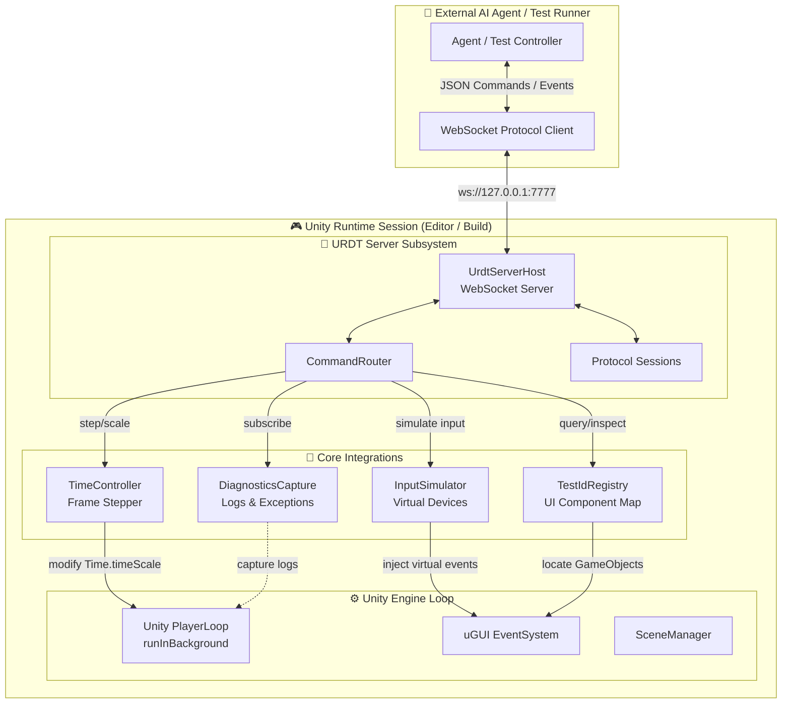

# 📡 DavASko URDT (Unity Remote Debugging Transport)

**A high-fidelity, asynchronous WebSocket protocol and virtual input simulation engine that allows AI agents and automation harnesses to test Unity applications in real time.**

🌐 **English** · [Русская версия](README.ru.md)

DavASko URDT (Unity Remote Debugging Transport) is the **reference driver** for **RDT (Runtime Debug Tool)**—an engine-independent core architecture designed for end-to-end (E2E) testing and closed-loop AI debugging. 

By running a lightweight WebSocket server inside the Unity runtime (both in-editor and in standalone builds), it enables external AI agents (like Harness or Ollama research agents) to query UI hierarchies, inspect properties, simulate high-fidelity virtual inputs, control execution ticks (pause/frame-step), and subscribe to real-time logs, exceptions, and lifecycle changes.


> **Real UI validation:** [coverage, principles, evidence, and results](UI_REAL_INPUT_VALIDATION.md).

---

## 🧭 Table of Contents

1. [What is this, in one picture](#1-what-is-this-in-one-picture)
2. [Why it exists & Core Goals](#2-why-it-exists--core-goals)
3. [Architecture: Core RDT vs. Engine Drivers](#3-architecture-core-rdt-vs-engine-drivers)
4. [The Honest Input Invariant & Tiers](#4-the-honest-input-invariant--tiers)
5. [The Observe-Act-Delta Loop](#5-the-observe-act-delta-loop)
6. [Deterministic Time & Frame Stepping](#6-deterministic-time--frame-stepping)
7. [Multi-Instance Identity & Protection](#7-multi-instance-identity--protection)
8. [Subsystems & Class Mapping](#8-subsystems--class-mapping)
9. [JSON API Protocol Specification](#9-json-api-protocol-specification)
10. [Repository Layout](#10-repository-layout)

---

## 1. 🖼️ What is this, in one picture

Think of URDT as a **remote control receiver** inside Unity. An external agent connects via WebSocket, retrieves the active UI layout, simulates exact player inputs, and tracks diagnostic changes.



---

## 2. 🤔 Why it exists & Core Goals

Testing Unity games has historically been complex and fragile. Traditional testing tools either run strictly inside Unity assembly boundaries (preventing AI agents from reasoning and orchestrating dynamically) or rely on brittle OS-level mouse control that breaks on resolutions, lacks canvas hit-testing, or cannot run headlessly.

URDT solves these problems with three core goals:

1. **High-Fidelity Virtual Input**: Instead of hacking component callback methods directly (which skips validation checks, layout updates, and animation states), URDT uses Unity's **Input System** to create virtual keyboard, pointer, and gamepad devices. Interactions flow realistically through the game's standard input pipeline.
2. **Stable UI Reference (`TestId`s)**: Paths in the scene hierarchy change frequently. URDT uses a thread-safe UI registry matching stable `TestId` attributes, meaning tests don't break when components are rearranged or nested inside layout groups.
3. **Non-Intrusive Integration**: Runs in background loops, auto-configures port mapping, and handles multi-client handshakes natively.

---

## 3. 🌐 Architecture: Core RDT vs. Engine Drivers

Like the **Selenium/WebDriver** or **Appium** patterns, URDT splits the framework into an engine-independent protocol and engine-specific drivers:

```
┌───────────────────────────────────────────────┐
│  RDT CORE (Engine-Independent Core)           │
│  • JSON-WebSocket wire-protocol               │
│  • Command Catalog (semantics & routing)      │
│  • Evidence-based verdict models              │
│  • Closed-loop AI debug state machine         │
└──────────────────────┬────────────────────────┘
                       │ Engine Driver SPI (Contract)
         ┌─────────────┴─────────────┐
         ▼                           ▼
┌──────────────────┐       ┌────────────────────────┐
│ URDT (Unity)     │       │ CCRDT (Cocos Creator)  │
│ InputSystem,     │       │ cc.input/EventTarget,  │
│ Physics.Raycast, │       │ UITransform.hitTest,   │
│ Time.timeScale   │       │ scheduler/Director     │
└──────────────────┘       └────────────────────────┘
```

*   **RDT Core**: Governs the wire protocol (JSON envelopes, request/response correlation, error structure), command definitions, and evaluation models.
*   **Engine Driver SPI**: An interface contract that any driver must implement (e.g., how to simulate pointer movements, find element coordinates, freeze/advance frames, and grab logs).
*   **URDT (Unity)**: The reference implementation utilizing Unity’s `UnityEngine.InputSystem`, `EventSystem`, `Physics.Raycast`, and custom player loop hooks.

---

## 4. 🖱️ The Honest Input Invariant & Tiers

The core rule of URDT is **only honest input**. Changing component variables or invoking button click callbacks directly is forbidden because it bypasses layout, physics, blocking panels, and input mapping rules. 

We classify input honesty into three Tiers:

| Tier | Simulation Mode | Target Verification | Honesty Verdict |
|:---:|:---|:---|:---|
| **T0** | Direct invoke (e.g., `button.onClick.Invoke()`, setting `slider.value`) | None. Bypasses blocking colliders, raycast targets, and UI layers. | ❌ **Forbidden** |
| **T1** | EventSystem Injection (e.g., `ExecuteEvents.Execute`) | uGUI-only. Tests event handlers but bypasses virtual bindings. | ⚠️ **Fallback-Only** |
| **T2** | Virtual Device State Queue (`InputSystem.QueueStateEvent`) | Complete Input System Stack: Virtual device ➔ action maps/bindings ➔ uGUI `InputSystemUIInputModule` ➔ gameplay code. | ✅ **Device-Honest (URDT Main)** |

### Legacy `Input.*` Limitation
Unity's legacy `Input` Manager (e.g. `Input.mousePosition` or `Input.GetMouseButton`) is a native OS-level event reader. No bridge from the new `InputSystem` can feed it virtual events. Therefore, to use URDT, all gameplay input-reading logic (e.g., drag control systems, joystick pollers) must be migrated to the new `InputSystem` APIs (`Pointer.current`, `Mouse.current`, or Action Map bindings).

---

## 5. 🔄 The Observe-Act-Delta Loop

To make automated testing robust, URDT enforces a transaction-based **Observe-Act-Delta** loop. AI agents must verify pre-conditions and post-conditions rather than assuming success:

1. **Observe**: Run `query` or `inspect` commands to ensure the target element exists, is visible, is unblocked (`hittable: true`), and is in the active scene.
2. **Act**: Execute a high-fidelity input interaction (e.g. `click` at coordinates retrieved in step 1).
3. **Delta**: Fetch the subsequent UI or game state (`wait_for` or `query` updates) to check if the expected state transition occurred. A response of `clicked: true` only verifies input delivery, not logical success.

---

## 6. ⏱️ Deterministic Time & Frame Stepping

Relying on wall-clock time causes flaky tests due to garbage collection spikes, asset loading delays, or FPS drops. URDT supports two time modes:

| Mode | Clocks | Frame Execution | Guarantee |
|:---|:---|:---|:---|
| **deterministic** | Pinned logical updates (`deltaTime`/`fixedDeltaTime`) | Advanced strictly by client `step_frame` commands. Game logic/tweens are frozen between steps. | 🎯 **100% Reproducibility (Default for CI/E2E)** |
| **realtime** | Wall-clock time | Driven automatically by Unity PlayerLoop. | 🏃 **Best-Effort (Manual debugging)** |

### Pinned Physics and Inputs
In deterministic mode, URDT freezes Unity update ticks (`Time.timeScale = 0` or custom hooks) and switches the Input System updates to `UpdateMode.ProcessEventsManually`. On receiving `step_frame`, the engine processes input events, triggers fixed physics updates via `Physics.Simulate(fixedDelta)`, and steps the main update loop exactly N times before freezing again.

### Determinism Leaks (Must avoid in game code)
To maintain 100% determinism, game logic must not depend on "unscaled" time channels. Avoid:
*   Unscaled tweens (`DOTween.SetUpdate(true)`)
*   Unscaled delays (`UniTask.Delay(..., ignoreTimeScale: true)`)
*   Thread pool delays (`Task.Delay`) that run on background threads outside the player loop.
*   Animator components running in `UnscaledTime` mode.

---

## 7. 🛡️ Multi-Instance Identity & Protection

When running test pools on a machine (or CI node), multiple Unity instances may run concurrently. URDT implements specific identity controls:

*   **Port Auto-negotiation**: URDT doesn't bind to a single port; it probes ports sequentially and broadcasts its connection endpoints.
*   **Identity Handshake**: A connection handshake must validate:
    *   `projectId`: The logical project ID (e.g., `dentistry-cow`).
    *   `projectPathHash`: Fingerprint of the repository clone path.
    *   `instanceId`: Process ID or unique run GUID.
    *   `peerRole`: The role of this node (`host`, `client-1`, `standalone`).
*   **Readiness Assertions**: The host must report `health.runtime_ready = true` (verifying a recent main-thread tick) before accepting commands.

---

## 8. 🧩 Subsystems & Class Mapping

| Subsystem | Main Classes | Key Responsibility |
|---|---|---|
| **Host/Server** | [UrdtServerHost](file:///e:/UnityProjects/IRI/dentistry-cow/Assets/KBPro/kbpro-plugins/DavASkoURDT/Runtime/UrdtServerHost.cs), `DebugServer` | Manages background WebSocket connections, parses frames, and queues commands. |
| **Driver** | `UnityUrdtDriver`, `MainThreadDispatcher` | Runs update ticks, hooks into the Unity PlayerLoop, and dispatches actions on the main thread. |
| **Input Sim** | `InputSimulator`, `InputPayloadReader` | Scaffolds virtual mouse/touch devices and queues raw state packets. |
| **Registry** | `TestIdRegistry`, `TestId` | Caches mapping between developer-assigned ID labels and active GameObjects. |
| **Inspect/UI** | `StateInspector`, `HitTestHandler` | Performs GraphicRaycasts to verify target visibility and calculates absolute canvas coordinates. |
| **Timing** | `TimeController`, `StepFrameHandler` | Pins delta times, halts player loop, and executes physics cycles manually. |
| **Diagnostics** | `DiagnosticsCapture` | Connects Unity debug logs/exceptions to WS stream and records base64 frame buffers. |

---

## 9. ⌨️ JSON API Protocol Specification

### 9.1. Message Envelope
Every WebSocket frame contains a JSON wrapper. Requests and Responses correlate using the message `id`.

**Request Structure:**
```json
{
  "api": 1,
  "id": "req-101",
  "action": "click",
  "payload": {
    "x": 480.0,
    "y": 360.0
  },
  "timeout_ms": 5000
}
```

**Response (Success):**
```json
{
  "api": 1,
  "id": "req-101",
  "type": "response",
  "status": "ok",
  "data": {
    "interacted": true,
    "target": "StartButton"
  },
  "elapsed_ms": 4
}
```

**Response (Error):**
```json
{
  "api": 1,
  "id": "req-101",
  "type": "response",
  "status": "error",
  "error": {
    "code": "E_NOT_HITTABLE",
    "message": "Click target is blocked by UI Panel 'LoadingOverlay'",
    "details": {}
  },
  "elapsed_ms": 2
}
```

---

### 9.2. Core Commands

#### 🤝 Handshake (`handshake`)
Establishes the session, checks compatibility, and configures screen settings.
*   **Request:**
    ```json
    { "api": 1, "id": "1", "action": "handshake", "payload": { "peerRole": "agent" } }
    ```
*   **Response data:**
    ```json
    {
      "token": "a4f89d-773a",
      "projectId": "dentistry-cow",
      "activeScene": "GameScene",
      "screenWidth": 1920,
      "screenHeight": 1080
    }
    ```

#### 🔍 Query (`query`)
Resolves coordinates and clickability state of an object registered via `TestId`.
*   **Request:**
    ```json
    { "api": 1, "id": "2", "action": "query", "payload": { "selector": "TestId:close_btn" } }
    ```
*   **Response data:**
    ```json
    {
      "found": true,
      "name": "BtnClose",
      "x": 960.0,
      "y": 540.0,
      "width": 80.0,
      "height": 40.0,
      "visible": true,
      "hittable": true
    }
    ```

#### 🖱️ Click (`click`)
Simulates pointer press (Down -> hold -> Up) on target coordinates.
*   **Request:**
    ```json
    { "api": 1, "id": "3", "action": "click", "payload": { "x": 960.0, "y": 540.0 } }
    ```
*   **Response data:**
    ```json
    { "interacted": true, "target": "BtnClose" }
    ```

#### ⏳ Step Frame (`step_frame`)
Ticks the engine loop exactly N steps. (Valid only in deterministic mode).
*   **Request:**
    ```json
    { "api": 1, "id": "4", "action": "step_frame", "payload": { "frames": 10 } }
    ```
*   **Response data:**
    ```json
    { "stepped": 10 }
    ```

#### 🎙️ Subscribe (`subscribe`)
Subscribes to server-pushed events.
*   **Request:**
    ```json
    { "api": 1, "id": "5", "action": "subscribe", "payload": { "events": ["log_callback", "scene_loaded"] } }
    ```
*   **Server Event Push Example:**
    ```json
    {
      "api": 1,
      "type": "event",
      "event": "log_callback",
      "data": {
        "logType": "Exception",
        "condition": "NullReferenceException: Object reference not set...",
        "stackTrace": "at KBP.Game.Controller.Update()..."
      }
    }
    ```

---

## 10. 🗂️ Repository Layout

```
DavASkoURDT/
├── Runtime/                         # Core execution logic
│   ├── Diagnostics/                 # Logger callbacks, exceptions
│   ├── Discovery/                   # Identity handshakes, UDP multicast
│   ├── Driver/                      # Main updates, PlayerLoop hooks
│   ├── Handlers/                    # Command parsers & execution actions
│   ├── Input/                       # Virtual Input System devices
│   ├── Inspect/                     # UI hit-testing, visual debugging
│   ├── Lifecycle/                   # Scene management triggers
│   ├── Net/                         # Tcp/WebSocket server implementation
│   ├── Registry/                    # Thread-safe TestId indexes
│   ├── Timing/                      # Time controller, frame steppers
│   ├── Transport/                   # Protocol packets, serializer structures
│   ├── UrdtRuntimeInfo.cs
│   ├── UrdtRuntimeVisualizer.cs     # On-screen overlay for debug inspection
│   ├── UrdtServerHost.cs            # Composition root MonoBehavior
│   ├── UrdtServerState.cs
│   └── KBP.URDT.asmdef              # Assembly definition
├── Editor/                          # Editor-only inspectors & utilities
├── Tests/                           # PlayMode and EditMode test suites
├── URDT_UI_Debug_Plan.md            # Debug verification suite checklist
└── URDT_UI_Debug_Report.md          # Real UI-runs execution report
```