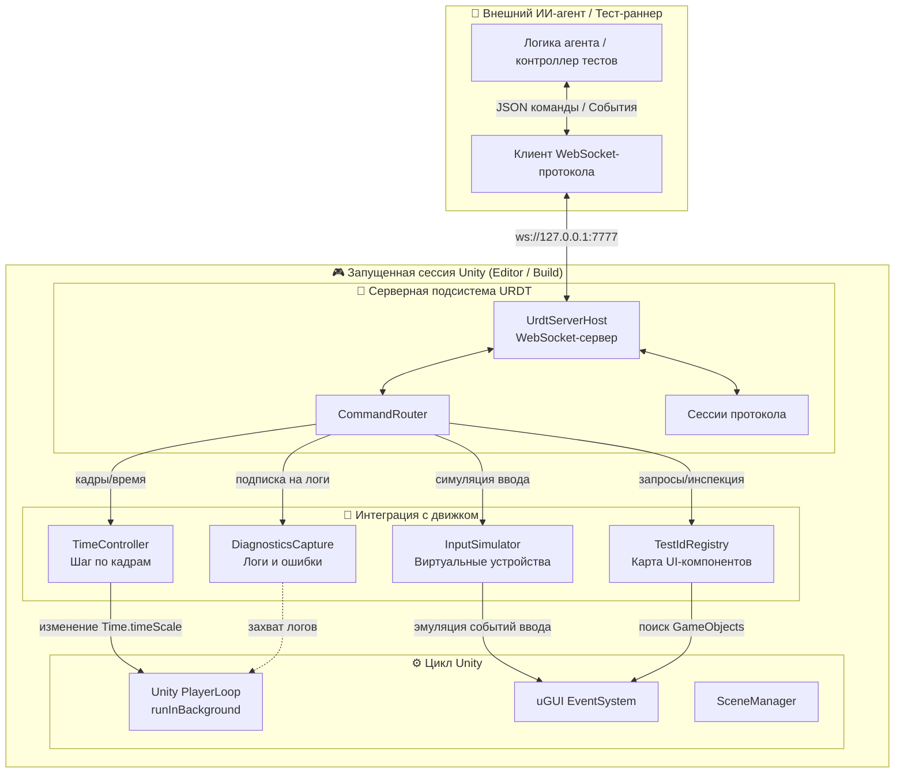

# 📡 DavASko URDT (Unity Remote Debugging Transport)

**Высокоточный асинхронный протокол WebSocket и движок симуляции виртуального ввода, позволяющий ИИ-агентам и системам автоматизации тестировать приложения на Unity в реальном времени.**

🌐 [English version](README.md) · **Русский**

DavASko URDT (Unity Remote Debugging Transport) является **эталонным драйвером (reference driver)** для **RDT (Runtime Debug Tool)** — движко-независимого ядра архитектуры сквозного (E2E) тестирования и замкнутого ИИ-цикла отладки игр.

Развертывая легковесный WebSocket-сервер внутри Unity (как в редакторе, так и в автономных сборках), он позволяет внешним ИИ-агентам (таким как Harness или исследовательские агенты Ollama) запрашивать активную иерархию интерфейса (UI), проверять свойства объектов, имитировать высокоточный виртуальный ввод (клики, перетаскивания, ввод текста с клавиатуры, жесты касания), управлять временем выполнения (пауза, изменение масштаба времени, пошаговое выполнение кадров) и подписываться на оперативную диагностику, логи исключений и события сцены.


> **Проверка реального UI-ввода:** [состав тестов, принципы, доказательства и результаты](UI_REAL_INPUT_VALIDATION.md).

---

## 🧭 Содержание

1. [Что это — одной картинкой](#1-что-это--одной-картинкой)
2. [Зачем это нужно и основные цели](#2-зачем-это-нужно-и-основные-цели)
3. [Архитектура: Ядро RDT против Драйверов движка](#3-архитектура-ядро-rdt-против-драйверов-движка)
4. [Инвариант «честного ввода» и уровни честности (Tiers)](#4-инвариант-честного-ввода-и-уровни-честности-tiers)
5. [Цикл «Наблюдение -> Действие -> Дельта»](#5-цикл-наблюдение---действие---дельта)
6. [Детерминизм и пошаговый контроль времени](#6-детерминизм-и-пошаговый-контроль-времени)
7. [Идентификация и защита от многоэкземплярности](#7-идентификация-и-защита-от-многоэкземплярности)
8. [Основные архитектурные компоненты и классы](#8-основные-архитектурные-компоненты-и-классы)
9. [Спецификация протокола JSON API](#9-спецификация-протокола-json-api)
10. [Структура репозитория](#10-структура-репозитория)

---

## 1. 🖼️ Что это — одной картинкой

Представьте URDT как **приемник дистанционного управления** внутри Unity. Внешний агент подключается по WebSocket, считывает активную разметку UI, имитирует точные действия игрока и отслеживает изменения состояния.



---

## 2. 🤔 Зачем это нужно и основные цели

Тестирование игр на Unity исторически является сложной и хрупкой задачей. Традиционные инструменты тестирования либо работают строго внутри сборок Unity (что мешает ИИ-агентам динамически рассуждать и координировать действия), либо полагаются на хрупкий клик по экранным координатам ОС, который ломается при изменении разрешения, игнорирует перекрытие UI-элементов и не может выполняться в фоновом режиме.

URDT решает эти проблемы, преследуя три основные цели:

1. **Высокоточный виртуальный ввод**: Вместо прямого вызова методов-обработчиков кнопок (что обходит проверки на кликабельность, анимации и обновление макетов), URDT использует **Input System** для создания виртуальной мыши, клавиатуры и геймпада. Взаимодействие реалистично проходит через стандартный конвейер ввода Unity.
2. **Стабильные ссылки на UI (`TestId`)**: Пути в иерархии сцены часто меняются. URDT использует потокобезопасный реестр UI, сопоставляющий элементы со стабильными атрибутами `TestId`. Благодаря этому тесты не ломаются при перестановке UI-компонентов или их переносе внутрь новых контейнеров разметки.
3. **Ненавязчивая интеграция**: Работает в фоновом режиме, автоматически подбирает свободные порты и из коробки управляет сессиями нескольких клиентов.

---

## 3. 🌐 Архитектура: Ядро RDT против Драйверов движка

Подобно паттернам **Selenium/WebDriver** или **Appium**, URDT разделяет систему на стабильное ядро протокола и сменные драйверы под каждый движок:

```
┌───────────────────────────────────────────────┐
│  RDT CORE (Движко-независимое ядро)            │
│  • Протокол обмена (WS + JSON Envelope)        │
│  • Каталог и семантика команд                 │
│  • Модель вердикта на основе доказательств     │
│  • Замкнутый ИИ-цикл отладки (state machine)   │
└──────────────────────┬────────────────────────┘
                       │ Engine Driver SPI (Контракт)
         ┌─────────────┴─────────────┐
         ▼                           ▼
┌──────────────────┐       ┌────────────────────────┐
│ URDT (Unity)     │       │ CCRDT (Cocos Creator)  │
│ InputSystem,     │       │ cc.input/EventTarget,  │
│ Physics.Raycast, │       │ UITransform.hitTest,   │
│ Time.timeScale   │       │ scheduler/Director     │
└──────────────────┘       └────────────────────────┘
```

*   **RDT Core**: Отвечает за транспортный протокол (JSON-обертки, корреляцию ID, структуру ошибок), семантику команд и модели вынесения вердиктов.
*   **Engine Driver SPI**: Контракт способностей, который обязан реализовать каждый драйвер (например, как перемещать виртуальный курсор, определять координаты объектов, замораживать кадры и перехватывать логи).
*   **URDT (Unity)**: Эталонная реализация драйвера для Unity с использованием `UnityEngine.InputSystem`, `EventSystem`, `Physics.Raycast` и кастомных хуков жизненного цикла.

---

## 4. 🖱️ Инвариант «честного ввода» и уровни честности (Tiers)

Ключевое правило URDT — **только честный ввод**. Прямое изменение переменных компонентов или вызов событий (например, `button.onClick.Invoke()`) запрещены, поскольку они обходят макеты экранов, физику, блокирующие панели и маппинг управления.

Мы классифицируем честность ввода по трем уровням (Tiers):

| Tier | Способ эмуляции | Что реально тестируется | Вердикт честности |
|:---:|:---|:---|:---|
| **T0** | Прямой вызов (например, `button.onClick.Invoke()`, ручное изменение `slider.value`) | Ничего, кроме обработчика. Обходит перекрытия, коллайдеры и блокирующие слои UI. | ❌ **Запрещено** |
| **T1** | Инъекция uGUI/EventSystem (через `ExecuteEvents.Execute`) | Только uGUI-обработчики. Обходит систему биндингов и InputAction. | ⚠️ **Только как Fallback** |
| **T2** | Виртуальное устройство Input System (`InputSystem.QueueStateEvent`) | Весь стек ввода движка: Устройство ➔ Action Maps/Bindings ➔ uGUI `InputSystemUIInputModule` ➔ код геймплея. | ✅ **Абсолютно честно (Основной путь)** |

### Ограничение legacy `Input.*`
Старая система ввода Unity (legacy `Input` Manager, например `Input.mousePosition` or `Input.GetMouseButton`) читает события ОС нативно. Моста из нового `InputSystem` в неё не существует. Поэтому для использования URDT все вводозависимые системы в игре (например, логика перетаскивания объектов или джойстики) должны быть переведены на новые API (`Pointer.current`, `Mouse.current` или Action Maps).

---

## 5. 🔄 Цикл «Наблюдение -> Действие -> Дельта»

Для надежного автоматизированного тестирования URDT обязывает ИИ-агентов следовать транзакционной модели **Observe-Act-Delta**:

1. **Observe (Наблюдение)**: Запросить состояние экрана через команды `query` или `inspect`. Убедиться, что элемент существует, активен, не перекрыт другими панелями (`hittable: true`) и находится в нужных границах.
2. **Act (Действие)**: Выполнить реальное устройство-честное действие (например, `click` по координатам, полученным на шаге 1).
3. **Delta (Изменение)**: Снять новое состояние игры (`wait_for` или повторный `query`). Факт успешного клика доказывается именно изменением состояния игры, а не возвращенным флагом `interacted: true` (который подтверждает лишь доставку события устройством).

---

## 6. ⏱️ Детерминизм и пошаговый контроль времени

Тесты, завязанные на системное время (wall-clock), нестабильны из-за пиков сборщика мусора (GC), задержек диска при загрузке ассетов или падения FPS. URDT поддерживает два режима времени:

| Режим | Часы | Обновление кадров | Гарантия |
|:---|:---|:---|:---|
| **deterministic** | Логические тики URDT (`deltaTime`/`fixedDeltaTime` зафиксированы) | Кадры продвигаются строго по командам `step_frame` от клиента. Время игры заморожено между командами. | 🎯 **100% Воспроизводимость физики и твинов (CI/E2E)** |
| **realtime** | Настоящее время системы | Кадры обновляются автоматически циклом Unity. | 🏃 **Best-Effort (Ручная отладка)** |

### Фиксация физики и событий ввода
В deterministic-режиме URDT переключает Input System в режим `UpdateMode.ProcessEventsManually` и устанавливает `Time.timeScale = 0`. При получении команды `step_frame` движок выполняет симуляцию физики `Physics.Simulate(fixedDelta)` и прокачивает события ввода ровно на N кадров, после чего снова замораживает время.

### Утечки детерминизма (Каналы, которых нужно избегать в коде игры)
Чтобы сохранить воспроизводимость, игровая логика не должна использовать каналы **unscaled**-времени:
*   Твины вне времени (`DOTween.SetUpdate(true)`)
*   Асинхронные задержки (`UniTask.Delay(..., ignoreTimeScale: true)`)
*   Задержки пула потоков (`Task.Delay`), выполняющиеся параллельно главному циклу.
*   Анимации в `UnscaledTime` режиме.

---

## 7. 🛡️ Идентификация и защита от многоэкземплярности

При параллельном запуске тестов (например, в CI-очереди) на машине могут одновременно работать несколько редакторов или плееров Unity. URDT реализует следующие защитные меры:

*   **Динамический подбор портов**: URDT сканирует порты по цепочке и объявляет свой порт по UDP/Discovery.
*   **Согласование Identity**: В первом запросе `handshake` сверяются:
    *   `projectId`: логический идентификатор проекта (например, `dentistry-cow`).
    *   `projectPathHash`: уникальный хэш пути к клону репозитория.
    *   `instanceId`: GUID процесса или экземпляра.
    *   `peerRole`: роль экземпляра (`host`, `client-1`, `standalone`).
*   **Контроль готовности**: Сервер принимает команды только при `health.runtime_ready = true` (проверка активности основного потока Unity за последние секунды).

---

## 8. 🧩 Основные архитектурные компоненты и классы

| Компонент | Главные классы | Зона ответственности |
|---|---|---|
| **Хост/Сервер** | [UrdtServerHost](file:///e:/UnityProjects/IRI/dentistry-cow/Assets/KBPro/kbpro-plugins/DavASkoURDT/Runtime/UrdtServerHost.cs), `DebugServer` | Прием WebSocket-подключений в фоне, парсинг фреймов и накопление очереди команд. |
| **Драйвер** | `UnityUrdtDriver`, `MainThreadDispatcher` | Реализация SPI, выполнение команд в главном потоке Unity с ограничением времени на кадр. |
| **Симулятор ввода** | `InputSimulator`, `InputPayloadReader` | Создание виртуальных устройств мыши/клавиатуры/экрана, генерация пакетов состояния. |
| **Реестр UI** | `TestIdRegistry`, `TestId` | Индексация объектов сцены по назначенным разработчиком строковым ID. |
| **Инспектор UI** | `StateInspector`, `HitTestHandler` | Проведение GraphicRaycast для проверки перекрытия элементов и вычисления координат Canvas. |
| **Контроль времени** | `TimeController`, `StepFrameHandler` | Замораживание времени, фиксация delta-времени и ручной вызов шагов физики. |
| **Диагностика** | `DiagnosticsCapture` | Захват Unity логов и исключений в WS-поток, кодирование скриншотов в Base64. |

---

## 9. Спецификация протокола JSON API

### 9.1. Обёртка сообщений (Envelope)
Каждое сообщение передается в виде текстового кадра JSON. Запросы и Ответы соотносятся по уникальному полю `id`.

**Структура запроса:**
```json
{
  "api": 1,
  "id": "req-101",
  "action": "click",
  "payload": {
    "x": 480.0,
    "y": 360.0
  },
  "timeout_ms": 5000
}
```

**Ответ (Успешный):**
```json
{
  "api": 1,
  "id": "req-101",
  "type": "response",
  "status": "ok",
  "data": {
    "interacted": true,
    "target": "StartButton"
  },
  "elapsed_ms": 4
}
```

**Ответ (Ошибка):**
```json
{
  "api": 1,
  "id": "req-101",
  "type": "response",
  "status": "error",
  "error": {
    "code": "E_NOT_HITTABLE",
    "message": "Клик перекрыт UI-панелью 'LoadingOverlay'",
    "details": {}
  },
  "elapsed_ms": 2
}
```

---

### 9.2. Базовые команды

#### 🤝 Handshake (`handshake`)
Инициализирует сессию, проверяет совместимость версий и передает размеры экрана.
*   **Запрос:**
    ```json
    { "api": 1, "id": "1", "action": "handshake", "payload": { "peerRole": "agent" } }
    ```
*   **Ответ (полезные данные):**
    ```json
    {
      "token": "a4f89d-773a",
      "projectId": "dentistry-cow",
      "activeScene": "GameScene",
      "screenWidth": 1920,
      "screenHeight": 1080
    }
    ```

#### 🔍 Query (`query`)
Возвращает координаты и возможность клика для элемента, зарегистрированного по `TestId`.
*   **Запрос:**
    ```json
    { "api": 1, "id": "2", "action": "query", "payload": { "selector": "TestId:close_btn" } }
    ```
*   **Ответ (полезные данные):**
    ```json
    {
      "found": true,
      "name": "BtnClose",
      "x": 960.0,
      "y": 540.0,
      "width": 80.0,
      "height": 40.0,
      "visible": true,
      "hittable": true
    }
    ```

#### 🖱️ Click (`click`)
Имитирует нажатие мыши/указателя (Down -> задержка -> Up) по экранным координатам.
*   **Запрос:**
    ```json
    { "api": 1, "id": "3", "action": "click", "payload": { "x": 960.0, "y": 540.0 } }
    ```
*   **Ответ (полезные данные):**
    ```json
    { "interacted": true, "target": "BtnClose" }
    ```

#### ⏳ Step Frame (`step_frame`)
Продвигает игровой цикл ровно на N кадров (актуально только в deterministic-режиме).
*   **Запрос:**
    ```json
    { "api": 1, "id": "4", "action": "step_frame", "payload": { "frames": 10 } }
    ```
*   **Ответ (полезные данные):**
    ```json
    { "stepped": 10 }
    ```

#### 🎙️ Subscribe (`subscribe`)
Регистрирует подписку на события сервера.
*   **Запрос:**
    ```json
    { "api": 1, "id": "5", "action": "subscribe", "payload": { "events": ["log_callback", "scene_loaded"] } }
    ```
*   **Пример события, присылаемого сервером:**
    ```json
    {
      "api": 1,
      "type": "event",
      "event": "log_callback",
      "data": {
        "logType": "Exception",
        "condition": "NullReferenceException: Object reference not set...",
        "stackTrace": "at KBP.Game.Controller.Update()..."
      }
    }
    ```

---

## 10. 🗂️ Структура репозитория

```
DavASkoURDT/
├── Runtime/                         # Основная логика выполнения
│   ├── Diagnostics/                 # Перехватчики логов и исключений
│   ├── Discovery/                   # Идентификация при подключении, UDP-вещание
│   ├── Driver/                      # Основной цикл обновления, хуки PlayerLoop
│   ├── Handlers/                    # Парсеры команд и действия по их выполнению
│   ├── Input/                       # Виртуальные устройства Input System
│   ├── Inspect/                     # Рейкасты UI, визуальная отладка
│   ├── Lifecycle/                   # События загрузки/выгрузки сцен
│   ├── Net/                         # Реализация Tcp/WebSocket-сервера
│   ├── Registry/                    # Потокобезопасный реестр TestId
│   ├── Timing/                      # Управление временем и шагом кадров
│   ├── Transport/                   # Пакеты протокола, структуры сериализации
│   ├── UrdtRuntimeInfo.cs
│   ├── UrdtRuntimeVisualizer.cs     # Графический оверлей инспектора на экране
│   ├── UrdtServerHost.cs            # Точка входа (MonoBehavior)
│   ├── UrdtServerState.cs
│   └── KBP.URDT.asmdef              # Assembly definition (определение сборки)
├── Editor/                          # Кастомные инспекторы редактора
├── Tests/                           # Наборы тестов PlayMode и EditMode
├── URDT_UI_Debug_Plan.md            # Чек-лист сценариев отладки интерфейса
└── URDT_UI_Debug_Report.md          # Отчёт реальных запусков сценариев
```