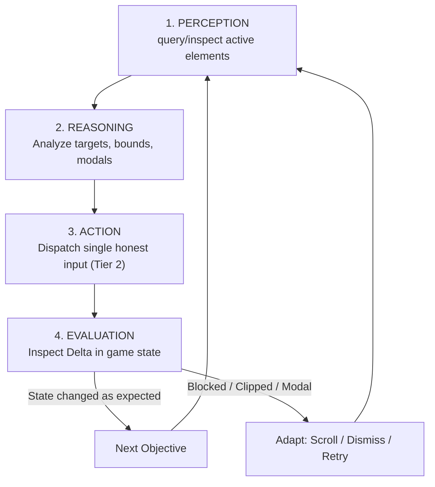

# The Autonomous AI Agentic Loop for Unity UI

## 1. Core Philosophy: The AI is the Player

**Never write a pre-baked, monolithic test script that executes 20 hardcoded steps in a black box process.**

The true purpose of URDT is to enable an **AI Agent to sit at the controls and play the game directly in runtime**:
- Exploring the UI dynamically.
- Inspecting the scene step-by-step.
- Making conscious, deliberate decisions based on what is currently on screen.
- Adapting to unexpected states, layout changes, modal popups, and scrolling viewports on the fly.

---

## 2. The 4-Phase Step-by-Step Loop

In every turn of testing or gameplay, the AI agent follows the **Perception-Reasoning-Action-Evaluation** cycle:



### Phase 1: Perception (Observe)
Send a lightweight query to URDT over WebSocket:
```json
{ "api": 1, "id": "1", "action": "query", "payload": { "activeOnly": true } }
```
Filter the response to examine visible elements:
- What window is currently active (`UrdtUiWindowTarget.ActiveWindow`)?
- What buttons, toggles, sliders, or inputs exist in this window?
- What are their screen positions (`ScreenRect`, `ScreenCenter`)?

### Phase 2: Reasoning (Deliberate)
Before clicking or typing, the AI analyzes:
1. **Is the target element on screen?**
   - Check `ScreenCenter.y`: Is it positive and within screen height (e.g. `0 <= y <= 1080`)?
   - If `y < 0` or `y > ScreenHeight`, the element is clipped by a scroll panel. **Do not click blindly!**
2. **Is a modal window open?**
   - If a modal window (`window_modal`) is active, it blocks raycasts to all elements behind it.
   - The AI must first dismiss or resolve the modal before interacting with background controls.
3. **What interaction is appropriate?**
   - `UrdtUiButtonTarget`: `click` or `double_click`
   - `UrdtUiToggleTarget`: `click` to invert boolean state
   - `UrdtUiSliderTarget`: `drag` with lerped steps to target float value
   - `UrdtUiInputTarget`: `click` to focus ➔ `type_text` to enter string
   - `UrdtUiDropdownTarget`: `click` to expand ➔ inspect options ➔ `click` option point
   - `UrdtUiScrollTarget`: `scroll` (wheel) or `swipe` (touch/drag)

### Phase 3: Action (Honest Input)
Dispatch **one specific, atomic action** via WebSocket:
```json
{ "api": 1, "id": "2", "action": "click", "payload": { "testId": "btn_open_ui_suite" } }
```
The input is processed by `InputSimulator` through the native Unity `InputSystem` device pipeline.

### Phase 4: Evaluation (Delta Assertion)
Immediately inspect the target or affected state to verify the delta:
```json
{ "api": 1, "id": "3", "action": "inspect", "payload": { "testId": "window_ui_suite" } }
```
- Verify that `ActiveWindow` transitioned to `window_ui_suite`.
- Verify that `InteractionCount` incremented.
- Verify that the text string changed or the modal appeared.
- If the delta is not observed, analyze why (e.g. element was occluded or required scrolling) and adapt immediately.

---

## 3. Dynamic Runtime Tactics

### A. Viewport Occlusion & Auto-Scrolling
When an element's `ScreenCenter` is outside the visible screen:
1. Locate the nearest ancestor `UrdtUiScrollTarget` (e.g. `ui.suite_scroll`).
2. If the target is below (`target.y < viewport.y`), swipe `direction: "up"`.
3. If the target is above (`target.y > viewport.y + height`), swipe `direction: "down"`.
4. Re-query the target coordinates until `target.ScreenCenter` is safely within the viewport, then execute the click.

### B. Modal Dialog Interception
When an action opens an unexpected or expected modal dialog:
1. Inspect `UrdtUiWindowTarget` for modal dialogs.
2. Locate the confirmation or close button (`UrdtUiButtonTarget`).
3. Click the close button, verify that `activeInHierarchy == false`, and resume testing.

### C. Text Editing
1. Click the `UrdtUiInputTarget` to establish caret focus.
2. Send `type_text` with the desired Unicode string.
3. Inspect `InputValue` to confirm character count and content.
4. To clear, send `type_text` with an empty string or backspace keys.

### D. Simultaneous Multi-Touch & Continuous Stick Steering
When an action requires simultaneous inputs (e.g. holding an action button while steering a joystick, or twin-stick move + aim):
1. **Never use `pointerId: 0` (Mouse) for multiple simultaneous actions** — the desktop mouse is strictly single-pointer; releasing or moving on target B will cancel the active hold on target A.
2. **Allocate dedicated touch channels** (`pointerId: 1..10`):
   - `Channel 1` (`pointerId: 1`): Primary action hold (e.g. `pointer_down` on `ui.btn_draw` or `hud.btn_attack`).
   - `Channel 2` (`pointerId: 2`): Virtual Stick deflection (e.g. `pointer_down` with offset on `ui.virtual_stick`).
   - `Channel 3` (`pointerId: 3`): Camera / secondary ability stick.
3. **Execute the Agentic Micro-Loop for Strokes / Movement**:
   - **Perceive**: Read starting position via `inspect { testId: "ui.drawing_canvas" }` (or actor position).
   - **Reason**: Compute desired direction $\vec{D} = (d_x, d_y)$, deflection point $(X_0, Y_0) + \hat{D} \times R$, and steering duration $T = \frac{L}{V} \times 1000\text{ms}$.
   - **Act**: Deflect stick on `pointerId: 2`, wait $T$ ms, release stick (`pointer_up`) to return to neutral $(0, 0)$.
   - **Evaluate**: Inspect target telemetry delta (`PenPosition`, `StrokeCount`, `TotalDrawnLength`). Verify pen moved by expected vector $\Delta \vec{P}$. If drift or obstacle detected, recompute adjustment stroke.
4. **Release Action Button**: Once drawing or combat sequence completes, send `pointer_up` on `Channel 1`.
5. For full mathematical derivations and sequence diagrams, consult [Multi-Touch & Stick Controls Guide](multitouch-and-stick-controls.md).

