# URDT Multi-Touch & Virtual Stick Controls Guide

This guide details how AI agents interact with **Virtual Joysticks / Sticks** and execute **Simultaneous Multi-Touch Actions** (e.g. holding an action button while steering a joystick) in live Unity games via URDT.

---

## 1. The Fundamental Multi-Touch Principle

On desktop platforms, standard mouse input is **strictly single-pointer**:
- A single mouse (`pointerId: 0`) cannot simultaneously hold down Button A and drag Stick B. Releasing or clicking with the mouse on Stick B cancels the active click/drag on Button A.
- To execute simultaneous actions (twin-stick shooting, holding fire while moving, holding "Draw" while steering a virtual pen), the AI agent must use **Tier 2 Multi-Touch Channels** (`pointerId: 1..10`).

### Channel Allocation Matrix

| Pointer Channel | Device Type | Common Usage | Behavior on Release |
|---|---|---|---|
| `pointerId: 0` | Virtual Mouse | Standard UI clicks, window navigation, scroll-wheel | Single cursor; mutual exclusive |
| `pointerId: 1` | Touch Finger 1 | Primary action hold (e.g. `ui.btn_draw`, primary fire, sprint) | Independent touch lifecycle (`TouchPhase.Began` -> `Ended`) |
| `pointerId: 2` | Touch Finger 2 | Movement / Direction steering (`ui.virtual_stick`, movement D-pad) | Independent touch lifecycle |
| `pointerId: 3` | Touch Finger 3 | Aiming / Camera stick or secondary ability toggle | Independent touch lifecycle |

---

## 2. Anatomy & Geometry of a Virtual Stick

A virtual stick (`UrdtUiStickTarget` on a `UrdtVirtualStick` GameObject) consists of two visual elements in uGUI:
1. **Background (Base)**: Anchored container defining the origin `ScreenCenter` $(X_0, Y_0)$.
2. **Handle (Knob)**: Movable child image that deflects away from $(X_0, Y_0)$ up to a maximum radius $R = \text{handleRange}$.

```
                 (X_0, Y_0 + R)  [UP]
                       ▲
                       │
       [LEFT]          │          [RIGHT]
  (X_0 - R, Y_0) ◄─────┼─────► (X_0 + R, Y_0)
                       │
                       │
                       ▼
                 (X_0, Y_0 - R)  [DOWN]
```

### Reading Stick Telemetry
An agent inspects the stick via `inspect { testId: "ui.virtual_stick" }`:
```json
{
  "UrdtUiStickTarget": {
    "StickX": 1.0,
    "StickY": 0.0,
    "Magnitude": 1.0,
    "IsPressed": true,
    "HandleScreenCenter": { "x": 1146.5, "y": 214.0 },
    "ScreenCenter": { "x": 1114.5, "y": 214.0 }
  }
}
```
- `StickX`, `StickY`: Normalized deflection vector $[-1.0 .. +1.0]$.
- `Magnitude`: Normalized deflection distance $\sqrt{X^2 + Y^2} \in [0.0 .. 1.0]$.
- `ScreenCenter`: The resting center of the base $(X_0, Y_0)$.
- `HandleScreenCenter`: The current screen position of the dragged knob.

---

## 3. Calculating Stick Deflection Coordinates

To steer in a desired direction $\vec{D} = (d_x, d_y)$:
1. **Normalize the direction vector**:
   $$\hat{D} = \frac{\vec{D}}{\|\vec{D}\|}$$
2. **Determine deflection offset**: Use an offset slightly within or equal to `handleRange` (e.g., $R_{\text{eff}} = 32\text{px}$):
   $$X_{\text{touch}} = X_0 + \hat{D}_x \cdot R_{\text{eff}}$$
   $$Y_{\text{touch}} = Y_0 + \hat{D}_y \cdot R_{\text{eff}}$$
3. **Dispatch `pointer_down`** at $(X_{\text{touch}}, Y_{\text{touch}})$ on channel `pointerId: 2`.
4. **Hold duration**: If steering a pen or vehicle with speed $V$ (px/sec) to cover distance $L$:
   $$T_{\text{ms}} = \frac{L}{V} \times 1000$$
5. **Release stick**: Dispatch `pointer_up` on channel `pointerId: 2` at $(X_{\text{touch}}, Y_{\text{touch}})$. The stick auto-centers to $(0, 0)$.

---

## 4. The Simultaneous Multi-Touch Action Pattern

### Scenario: Hold-to-Draw + Stick Steering (Drawing House or Slashing while Running)

```mermaid
sequenceDiagram
    autonumber
    participant AI as AI Agent
    participant WS as URDT WebSocket
    participant Btn as ui.btn_draw (Channel 1)
    participant Stick as ui.virtual_stick (Channel 2)
    participant Canvas as ui.drawing_canvas

    AI->>WS: pointer_down { testId: "ui.btn_draw", pointerId: 1 }
    WS->>Btn: Touch 1 Began (IsHeld = true)
    
    rect rgb(20, 35, 50)
        Note over AI,Canvas: Stroke Execution Loop
        AI->>WS: pointer_down { testId: "ui.virtual_stick", pointerId: 2, x, y }
        WS->>Stick: Touch 2 Began & Drag (InputVector != 0)
        Note over Canvas: Canvas deposits ink in real-time
        AI->>AI: Wait calculated duration (e.g. 900ms)
        AI->>WS: pointer_up { testId: "ui.virtual_stick", pointerId: 2 }
        WS->>Stick: Touch 2 Ended (InputVector = 0)
        AI->>WS: inspect { testId: "ui.drawing_canvas" }
        WS-->>AI: Returns new PenPosition, StrokeCount, Length
    end

    AI->>WS: pointer_up { testId: "ui.btn_draw", pointerId: 1 }
    WS->>Btn: Touch 1 Ended (IsHeld = false)
```



### Free Movement (Pen Up / Repositioning)
When repositioning without acting:
1. Ensure Channel 1 is released (`pointer_up` on action button).
2. Steer with Channel 2 (`pointer_down` -> wait -> `pointer_up` on stick).
3. The actor moves freely without leaving ink or triggering attacks.

---

## 5. Twin-Stick Controls (Move + Aim / Look)

For mobile twin-stick shooters or action games:
- Left Stick (`ui.stick_move`): Driven on `pointerId: 1`
- Right Stick (`ui.stick_aim`): Driven on `pointerId: 2`
- Fire / Jump Button: Driven on `pointerId: 3`

Each stick operates completely independently without cross-channel cancellation.

---

## 6. Multi-Touch Channel Lifecycle Manager for AI Agents

When an AI agent executes complex gameplay involving 2, 3, or more simultaneous touches, it should track active touch channels in its working memory:

```javascript
class MultiTouchManager {
    constructor(client) {
        this.client = client;
        this.activePointers = new Map(); // pointerId -> { targetId, downX, downY, startedAt }
        this.nextChannelId = 1;          // Start after mouse (pointerId 0)
    }

    acquireChannel() {
        for (let id = 1; id <= 10; id++) {
            if (!this.activePointers.has(id)) return id;
        }
        throw new Error('All 10 multi-touch channels are currently active!');
    }

    async holdTarget(testId, pointerId = null) {
        const channel = pointerId ?? this.acquireChannel();
        const snap = await this.client.call('inspect', { testId });
        const pos = snap.data.screenPosition;
        await this.client.call('pointer_down', { testId, pointerId: channel, x: pos.x, y: pos.y });
        this.activePointers.set(channel, { testId, downX: pos.x, downY: pos.y, startedAt: Date.now() });
        return channel;
    }

    async releaseTarget(pointerId) {
        const info = this.activePointers.get(pointerId);
        if (!info) return;
        await this.client.call('pointer_up', { testId: info.testId, pointerId, x: info.downX, y: info.downY });
        this.activePointers.delete(pointerId);
    }

    async releaseAll() {
        for (const [id, info] of Array.from(this.activePointers.entries())) {
            await this.client.call('pointer_up', { testId: info.testId, pointerId: id, x: info.downX, y: info.downY });
            this.activePointers.delete(id);
        }
    }
}
```

### Channel Management Rules:
1. **Never allocate Channel 0 (Mouse) for held actions** when other inputs will occur. Channel 0 is reserved for single-click operations or standard mouse navigation.
2. **Channel Isolation**: Each touch channel has an independent lifecycle in Unity `TouchSimulation` / `Touchscreen.current.touches[pointerId - 1]`.
3. **Safety Teardown (`releaseAll`)**: In `catch` blocks or session teardown, always call `releaseAll()` to ensure no virtual fingers remain permanently pressed on the screen if a task aborts or throws an exception.

---

## 7. Simultaneous Multi-Action Tactics & Patterns

### Tactic A: Hold-to-Charge + Aim Stick
- **Channel 1 (`pointerId: 1`)**: `pointer_down` on heavy attack button `ui.btn_charge`.
- **Channel 2 (`pointerId: 2`)**: `pointer_down` and `drag` on aim stick `ui.stick_aim` to adjust trajectory while charging.
- **Action**: When charge reaches threshold (verified via `inspect`), release Channel 1 (`pointer_up`) to fire, then release Channel 2 (`pointer_up`).

### Tactic B: Sprint Button + Directional Stick
- **Channel 1 (`pointerId: 1`)**: `pointer_down` on sprint button `ui.btn_sprint` (character shifts to running speed).
- **Channel 2 (`pointerId: 2`)**: Steer navigation stick `ui.stick_move`.
- **Action**: The character moves at $2\times$ speed along the deflection vector. Release stick when target waypoint is reached, then release sprint.

### Tactic C: Draw / Paint with Interactive Repositioning
- **Pen Down**: Hold `ui.btn_draw` on Channel 1.
- **Stroke**: Steer `ui.virtual_stick` on Channel 2 for computed duration.
- **Pen Up**: Release `ui.btn_draw` on Channel 1.
- **Reposition**: Steer `ui.virtual_stick` on Channel 2 to new starting point without leaving ink.

---

## 8. Common Pitfalls & How to Avoid Them

| Pitfall | Root Cause | Correct Fix |
|---|---|---|
| **Button releases when stick moves** | Re-using `pointerId: 0` (mouse) for both button and stick | Use distinct touch channels: `pointerId: 1` for button, `pointerId: 2` for stick |
| **Stick gets stuck deflected** | Missing `pointer_up` when steering finishes | Always pair every `pointer_down` with a matching `pointer_up` on the exact same `pointerId` |
| **Pen overshoots target corner** | Fixed sleep without checking telemetry | Query `inspect ui.drawing_canvas` after each stroke to measure actual delta, then apply fine-tune nudge |
| **No ink rendered on GPU** | `Texture2D.Apply()` called without `SetPixels32()` | In custom canvas components, ensure CPU pixel buffer is uploaded to GPU texture before `Apply()` |
| **Unreleased touches persist on error** | Script crashed while finger was down | Implement a `try ... finally` block calling `releaseAll()` to release all channels on exception |

