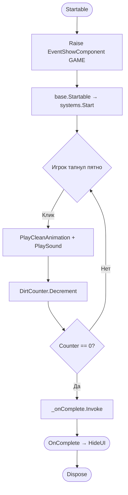
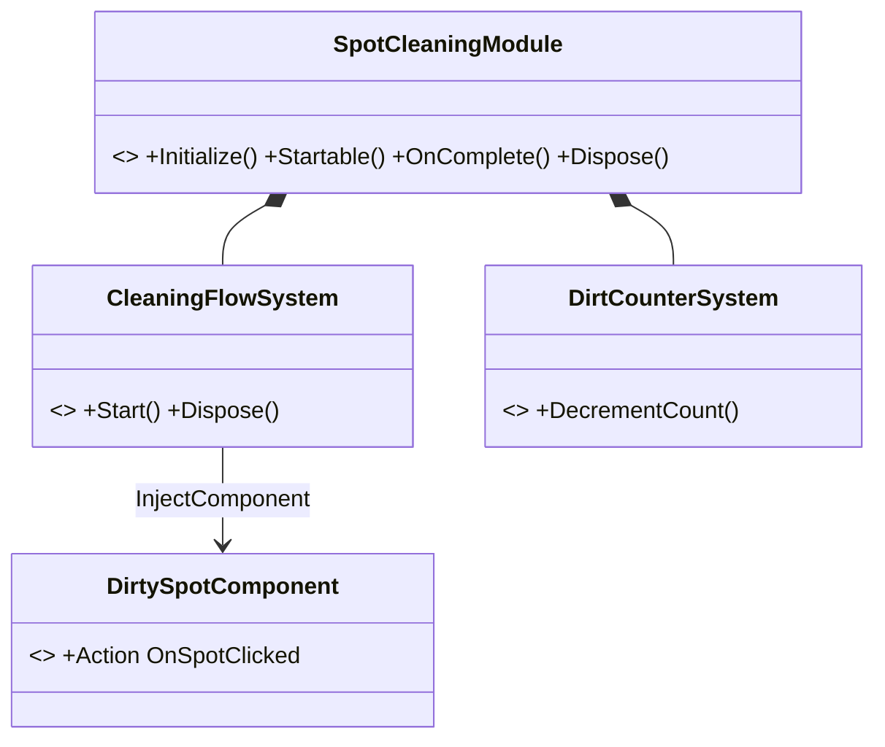
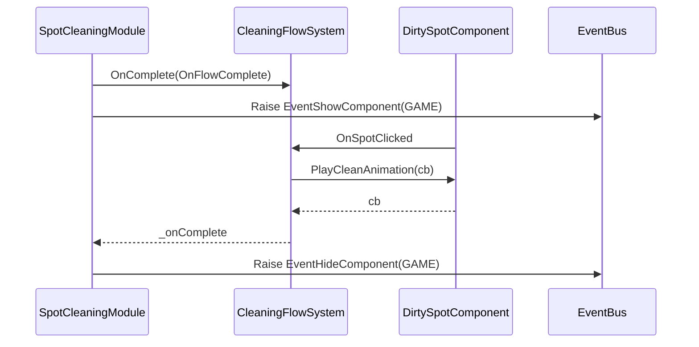

# Module Reference: Чистка пятен (SpotCleaningModule)

> ⚠️ **ЭТАЛОННЫЙ УЧЕБНЫЙ ПРИМЕР** для скилла `kbpro-module-describer`. Гипотетический простой модуль (на базе примера DirtySpot из `HowToCreateModule.md`). Показывает заполнение ВСЕХ reproduction-секций (3.6–3.10, 3bis, 7). Не реальный модуль проекта.

> **Класс модуля:** `SpotCleaningModule.cs`  
> **Путь в проекте:** `Assets/Railway-cow/Scripts/Modules/SpotCleaning/`  
> **Тип завершения:** AllObjectsProcessed  
> **Сложность:** Low  
> **Статус:** InDevelopment  
> **Задокументировано:** 2026-06-08  

---

## 1. Суть модуля (Plain Language)

Игрок видит несколько грязных пятен на объекте. По нажатию на пятно оно с анимацией исчезает и играет звук. Когда все пятна очищены — модуль завершается и управление возвращается дальше по сценарию.

**Пример задания:**
> «Мини-игра очистки: тапать по грязным пятнам, пятно исчезает с анимацией и звуком; когда пятен не осталось — конец.»

---

## 2. Флоу модуля

### Общая схема
1. **Запуск** — `Startable()` показывает HUD и запускает системы.
2. **Взаимодействие** — игрок тапает по пятнам; каждое проигрывает анимацию очистки и звук.
3. **Подсчёт** — `DirtCounterSystem` уменьшает счётчик оставшихся пятен.
4. **Завершение** — когда счётчик = 0, `CleaningFlowSystem` вызывает `_onComplete`.
5. **OnComplete** — скрывается HUD, `base.OnComplete()`.



### Описание каждого шага
| Шаг | Метод/Система | Что происходит |
|-----|--------------|----------------|
| 1. Startable | `SpotCleaningModule.Startable()` | `base.Startable()` → Raise `EventShowComponent(GAME)` |
| 2. Клик | `DirtySpotComponent.OnSpotClicked` | сигнал в `CleaningFlowSystem` |
| 3. Очистка | `CleaningFlowSystem.OnSpotClicked()` | `PlaySound` + `PlayCleanAnimation(cb)` |
| 4. Подсчёт | `DirtCounterSystem.DecrementCount()` | `RemainingCount--` |
| 5. Завершение | `CleaningFlowSystem` | при 0 → `_onComplete?.Invoke()` |

---

## 3. Структура модуля

### 3.1 Классовая иерархия


### 3.2 GameComponent
| Компонент | Файл | Назначение | Ключевые поля/методы |
|-----------|------|-----------|---------------------|
| `DirtySpotComponent` | `Components/DirtySpotComponent.cs` | пятно на сцене, клики | `Action OnSpotClicked`, `PlayCleanAnimation(Action)`, `ShowDirt()` |

### 3.3 LogicSystem
| Система | Файл | Назначение | Интерфейсы |
|---------|------|-----------|-----------|
| `CleaningFlowSystem` | `Systems/CleaningFlowSystem.cs` | реакция на клик, звук, завершение | — |
| `DirtCounterSystem` | `Systems/DirtCounterSystem.cs` | счётчик оставшихся пятен | `IUpdatable` |

### 3.4 Внешние сервисы (LazySrv)
| Сервис | Интерфейс | Для чего |
|--------|-----------|----------|
| Звук | `ISoundSystem` | звук очистки пятна |

### 3.5 EventBus события
| Событие | Тип | Direction | Когда |
|---------|-----|-----------|-------|
| `EventShowComponent` | Raise | Module → UI | в `Startable()` |
| `EventHideComponent` | Raise | Module → UI | в `OnComplete()` |

### 3.6 Конфигурация (полный список)
| Параметр | Тип | Дефолт | Влияние |
|---------|-----|--------|---------|
| `_delayToComplete` | float | 1.0f | задержка перед переходом к следующему модулю |
| `_cleanAnimDuration` | float | 0.3f | длительность fade-out пятна |
| `_cleanSoundId` | string | "dirt_clean" | id звука очистки |

### 3.7 Структура Prefab
```
SpotCleaningModule (GameObject) — SpotCleaningModule.cs
├── Spots
│   ├── DirtySpot_01 — DirtySpotComponent.cs
│   ├── DirtySpot_02 — DirtySpotComponent.cs
│   └── DirtySpot_03 — DirtySpotComponent.cs
└── [Systems on module: _systems = CleaningFlowSystem, DirtCounterSystem]
```
**Addressable Address:** `SpotCleaningModule` · **Group:** `Modules` · **SOGameModuleSettings ID:** `Constants.MODULES.SPOT_CLEANING`

### 3.8 Карта инъекций `[InjectComponent] ↔ _componentProviders`
| Поле в системе | Тип компонента | Провайдер | Объект-источник |
|----------------|----------------|-----------|-----------------|
| `CleaningFlowSystem._spotComponent` | `DirtySpotComponent` | `LinkedComponentProvider` | DirtySpot_01 |
| `DirtCounterSystem._spots` (`[]`) | `DirtySpotComponent[]` | `LinkedComponentProvider` ×3 | DirtySpot_01..03 |

### 3.9 Порядок lifecycle
| Метод | Порядок |
|-------|---------|
| `Initialize()` | `GetSystem<CleaningFlowSystem>()` → `flow.OnComplete(OnFlowComplete)` → **`base.Initialize()` последним** |
| `Startable()` | **`base.Startable()` первым** → Raise `EventShowComponent(GAME)` |
| `OnComplete()` | Raise `EventHideComponent(GAME)` → **`base.OnComplete()` последним** |
| `Dispose()` | (нет EventBinding) → `LazySrv.Dispose` в системе → **`base.Dispose()` последним** |

### 3.10 Скелет классов
```csharp
public class SpotCleaningModule : AbstractGameModule {
    private CleaningFlowSystem _flow;
    public override void Initialize() { /* _flow=GetSystem<>(); _flow.OnComplete(OnFlowComplete); base.Initialize() LAST */ }
    public override void Startable()  { /* base.Startable() FIRST; Raise EventShowComponent(GAME) */ }
    private void OnFlowComplete()      { OnComplete(); }
    public override void OnComplete()  { /* Raise EventHideComponent(GAME); base.OnComplete() LAST */ }
    public override void Dispose()     { /* base.Dispose() LAST */ }
}
public class CleaningFlowSystem : LogicSystem {
    [InjectComponent] private DirtySpotComponent _spotComponent;
    private LazySrv<ISoundSystem> _sound = new();
    public override void Initialize() { /* _spotComponent.OnSpotClicked += OnSpotClicked; base.Initialize() LAST */ }
    public override void Start() { /* _spotComponent.ShowDirt() */ }
    private void OnSpotClicked() { /* _sound.Value.PlaySound(...); _spotComponent.PlayCleanAnimation(OnCleanComplete) */ }
    private void OnCleanComplete() { /* _onComplete?.Invoke() */ }
    public override void Dispose() { /* unsubscribe; _sound.Dispose(); base.Dispose() LAST */ }
}
public class DirtySpotComponent : GameComponent<DirtySpotComponent>, IPointerClickHandler {
    [SerializeField] private SpriteRenderer _dirtSprite;
    public Action OnSpotClicked;
    public void OnPointerClick(PointerEventData e) { OnSpotClicked?.Invoke(); }
    public void PlayCleanAnimation(Action onComplete) { /* DOFade + onComplete */ }
    public void ShowDirt() { /* ... */ }
}
```

## 3bis. Контракт интеграции

### Constants
| Категория | Константа | Смысл |
|-----------|-----------|-------|
| Module ID | `Constants.MODULES.SPOT_CLEANING` | id для SOGameModuleSettings |
| UI окно | `Constants.UICOMPONENT.GAME` | HUD мини-игры |
| Звук | `"dirt_clean"` | звук очистки |
| Addressable | `SpotCleaningModule` | адрес префаба |

### Вход/выход
- **Базовый класс:** `AbstractGameModule`.
- **ModuleInput:** нет. **ModuleOutput:** нет.
- **Интеграция в сценарий:** запускается напрямую.

### Переиспользуемые примитивы
| Примитив | Откуда | Зачем |
|----------|--------|-------|
| `ISoundSystem` (LazySrv) | сервисы | звук очистки |
| `EventShowComponent/EventHideComponent` | EventBus | показ/скрытие HUD |
| `IPointerClickHandler` | UnityEngine.EventSystems | клик по пятну |

### Как запускается
```csharp
_moduleService.Value.Run(Constants.MODULES.SPOT_CLEANING);
```

---

## 4. Взаимодействие блоков


| Взаимодействие | Механизм | Почему |
|----------------|---------|--------|
| Component → System | `Action OnSpotClicked` | изоляция вью от логики |
| Module → UI | `EventBus<EventShowComponent>` | изоляция от UI |

---

## 5. Диаграмма времени

```mermaid
gantt
    title SpotCleaningModule
    dateFormat ss
    axisFormat %S сек
    section Init
    Initialize + DI :a1, 0, 1s
    section Play
    ShowUI :a2, after a1, 1s
    Player taps spots :crit, a3, after a2, 8s
    section End
    OnComplete + HideUI :a4, after a3, 1s
```


---

## 6. Заметки для ИИ

### ✅ Взять as-is
- Связка Module(оркестратор) → FlowSystem(логика) → Component(вью) с завершением через `_onComplete`.
- Подписка на `Action` компонента в `Initialize`, отписка в `Dispose`.

### 🔧 Доработать
- Счётчик: при 0 пятен на старте — добавить guard, чтобы не вызвать `OnComplete` мгновенно.

### ❌ Не повторять
- Явных нарушений не обнаружено (учебный пример).

### 📌 Цитата
```csharp
public override void Dispose() {
    if (_spotComponent != null) _spotComponent.OnSpotClicked -= OnSpotClicked;
    _sound.Dispose();
    base.Dispose();
}
```

---

## 7. Adaptation Guide

### 7.1 Класс задач
Однотипное «тапни/перетащи объект → он обрабатывается → когда все обработаны, конец». Подходит для: очистка пятен, сбор предметов, лопание пузырьков.

### 7.2 Взять без изменений
- `SpotCleaningModule` lifecycle и порядок `base.*`.
- Паттерн `Action`-сигнал из компонента + завершение через `_onComplete`.
- HUD через `EventShowComponent/EventHideComponent`.

### 7.3 Таблица замен
| В образце | Заменить на | Где |
|-----------|-------------|-----|
| `SpotCleaningModule` | `[New]Module` | класс + namespace `KBP.<PROJECT>.<NEW>` |
| `DirtySpotComponent` | компонент нового объекта | новый `GameComponent<T>` |
| `OnSpotClicked` / `PlayCleanAnimation` | действие/анимация нового объекта | компонент |
| условие `RemainingCount==0` | новое условие завершения | FlowSystem |
| `"dirt_clean"`, `SPOT_CLEANING`, `GAME` | новые Constants | SOConstantsContainer |
| `_cleanAnimDuration` и т.п. | значения под новый геймплей | конфиг |

### 7.4 Добавить при необходимости
- Несколько этапов → ввести FlowSystem-оркестратор + per-stage контроллеры (см. `TrainCleaningModule_reference.md`).
- Drag вместо клика → `DragLogicSystem` + туторы.

### 7.5 Рецепт
1. Скопировать скелет 3.10 → переименовать (Этапы 2–5 `HowToCreateModule.md`).
2. Применить таблицу замен 7.3.
3. Завести Constants из 3bis.
4. Собрать префаб + провайдеры (3.7/3.8) или Editor-builder (`HowToAutoGenerateModule_ForAI.md`).
5. Зарегистрировать в SOGameModuleSettings (Этап 7).
6. Прогнать чеклист `HowToCreateModule.md`.

### 7.6 Подводные камни
- Не забыть зарегистрировать ВСЕ `DirtySpotComponent` в `_componentProviders` (иначе `_spots[]` неполный).
