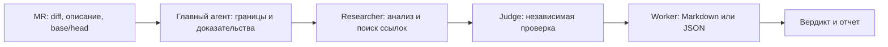

# Рецензент MR для KBPro

Проводит доказательное ревью Merge Request / Pull Request: C#-кода, Unity-ассетов,
префабов, сцен, ScriptableObject-конфигов и настроек импорта. Навык выдает только
подтвержденные, воспроизводимые замечания уровня `MEDIUM`, `CRITICAL` или `BLOCKER`;
`MINOR` допускается лишь для мертвого закомментированного кода.

## Оркестрация и fallback

Если в текущей задаче доступны native-субагенты и установлен `kbpro-subagent-team`,
используй его паттерн `code-review`:

1. Прочитать `kbpro-subagent-team/SKILL.md`, его реестр и выбрать паттерн
   `code-review`.
2. Главный агент фиксирует границы ревью: MR/ветки или base/head SHA, описание MR,
   формат результата, измененные артефакты и доступные проверки.
3. Назначить зарегистрированного `researcher` для анализа diff и затронутого контекста.
   Для независимых групп файлов можно назначить несколько исследователей; не дробить
   один файл между ними без необходимости.
4. После исследователя назначить зарегистрированного `judge`, который не выполнял
   исследовательскую работу. Он проверяет замечания по исходному diff, коду и правилам,
   а не доверяет черновику. При доступности выбирать модель другого семейства; если это
   невозможно, явно указать ограничение в итоговом отчете.
5. Назначить зарегистрированного `worker` только для механической нормализации
   подтвержденных замечаний в Markdown или JSON. Worker не меняет severity и не
   добавляет выводы.
6. Итог `PASS`, `CHANGES_REQUIRED` или `BLOCKED` формирует главный агент только после
   ответа независимого judge. Нельзя заменять отсутствующий ответ judge черновиком
   researcher или имитировать ответ агента.

При назначении ролей задавай **две независимые оси** — тир модели и уровень reasoning
effort — по [Model & Reasoning-Effort Selection](references/model-and-reasoning-effort-selection.md):
`researcher` → high–max тир, effort **high**; `judge` → medium тир, effort **medium**;
`worker` (нормализация Markdown/JSON) → cheap тир, effort **off/low**. Не ставь max
по умолчанию (убывающая отдача) и не проверяй критичное замечание слабой моделью на
низком усилии.

Если native-субагенты или `kbpro-subagent-team` недоступны, не запускай **дополнительный**
внешний CLI из уже запущенного review-agent и не имитируй ответы ролей. Выполни полное
ревью в текущем сеансе этого агента: самостоятельно собери доказательства,
выполни доступные машинные проверки и сформируй итоговый GitLab Markdown. В начале
отчёта обязательно укажи:

`Ограничения: Fallback current-chat review — native-субагенты недоступны; независимая judge-проверка не выполнена.`

В этом режиме `PASS` запрещён: верни `CHANGES_REQUIRED`, если есть подтверждённое
замечание, иначе `BLOCKED` с указанным ограничением. При следующем доступном запуске
субагентов такое ревью должно быть выполнено заново по полной цепочке.



## Вход и подготовка

Нужны источник diff (`base...head`, MR или локальные staged/unstaged изменения) и,
если доступно, название/описание MR. Если diff или целевая ревизия недоступны, вернуть
`BLOCKED` с недостающими данными — не угадывать область ревью.

Перед анализом главный агент:

1. Считывает измененные файлы и diff без внесения правок.
2. Открывает только применимые документы из `references/` и правила репозитория.
3. Фиксирует команды проверок и их фактический результат. Невыполнимую проверку
   отражает как ограничение, а не как успешную валидацию.

`scripts/code-review-pipeline.js` — устаревший эксперимент и **не является способом
запуска этого навыка**: он не умеет вызывать нативных субагентов и не должен запускать
внешние CLI в режимах обхода approval/sandbox. Не публикуйте комментарии или изменения
в GitLab/GitHub без отдельного явного разрешения пользователя.

## GitLab-доставка

Для запуска из рабочего дерева используется `Utils/code-review.ps1`. Это только
launcher: он получает GitLab MR metadata и полный diff и передаёт их агентному
исполнителю навыка; он не заменяет и не имитирует роли команды. Если агентный
исполнитель не поддерживает native-субагентов, применяется fallback текущего чата выше.
Launcher передаёт весь diff без фильтра по расширению, поэтому reviewer обязан
проверить применимые C#, prefab, scene, asset и `.meta` изменения.

GitLab-токен разрешено получать только из переменной окружения `GITLAB_TOKEN`. Токен
нельзя передавать аргументом, хранить в `.bat`/`.ps1`, включать в отчёт или выводить в
лог. После preview launcher публикует ровно показанный Markdown как общий MR note только
после явного интерактивного подтверждения. Публикация inline discussions — отдельная
функция и не должна имитироваться общим отчётом.

## Область проверки исследователя

Исследователь анализирует измененные строки и минимально необходимый внешний контекст.
При изменении публичных API, интерфейсов, базовых типов, ключей `BaseConfig` или
сигнатур `EventBus<T>` обязателен поиск потребителей вне diff. Каждое черновое замечание
должно содержать: относительный путь, строку измененного или непосредственно
затронутого кода, наблюдаемое условие, риск, ссылку на правило и минимальное исправление.

Проверять по применимости:

- архитектурные границы, DI и lifecycle KBPro;
- Unity hot paths, GC, физику и async/cancellation;
- утечки подписок, `UnityEditor` в runtime, секреты и небезопасные поиски объектов;
- YAML-ссылки префабов/сцен, `.meta` для новых ассетов и импорт ресурсов.

Не создавать замечания о форматировании, отступах, скобках или иных задачах линтера.
Не выносить замечание без конкретной причинно-следственной связи с изменением.

## Правила judge и вердикта

Judge отклоняет замечание, если оно не воспроизводится по доступному коду, не находится
в области diff/его доказуемого воздействия, дублирует другое замечание или является
стилистическим шумом. Он может изменить severity только с обоснованием.

- `BLOCKER`: сборка, безопасность, целостность ассетов или гарантированный критический
  сбой.
- `CRITICAL`: серьезная регрессия runtime, производительности или архитектурной границы.
- `MEDIUM`: доказуемый риск ошибки, отмены, совместимости или импорта.
- `MINOR`: только мертвый закомментированный код.

`PASS` требует независимого подтверждения judge и отсутствия подтвержденных замечаний.
`CHANGES_REQUIRED` — есть хотя бы одно подтвержденное замечание. `BLOCKED` — diff,
контекст, независимая проверка или обязательная машинная проверка недоступны настолько,
что честный вердикт невозможен.

## Формат результата

По умолчанию вернуть Markdown-отчет. Каждое поле замечания ОБЯЗАТЕЛЬНО начинается с новой строки (line break `\n` перед каждым emoji-маркером). НЕ объединяй несколько полей в одну строку. НЕ используй markdown-списки (`*`, `-`, `+`) перед полями.

Шаблон отчёта:

```text
> [!CAUTION|WARNING|TIP]
> Статус: PASS | CHANGES_REQUIRED | BLOCKED

---

🟡 **[SEVERITY]**
📍 **Локация**: [FileName.cs:L42](file:///absolute/path/FileName.cs#L42)
🔍 **Суть проблемы**: Наблюдаемое условие.
⚠️ **Потенциальные последствия**: Рантайм-риск.
ℹ️ **Пояснение**: Ссылка на правило.
🛠️ **Рекомендуемое решение**:
\`\`\`diff
- old
+ new
\`\`\`

---
```

Правила для полей:
- 📍 **Локация**: Абсолютный путь рабочего пространства в формате `file:///`. На Windows `\\` → `/`.
- 🔍 **Суть проблемы**: Код выделять inline code или fenced code blocks. HTML запрещён.
- ⚠️ **Потенциальные последствия**: Конкретный рантайм-риск.
- ℹ️ **Пояснение**: Ссылка на правило KBPro/Unity из `references/`.
- 🛠️ **Рекомендуемое решение**: Diff-формат.

Пути в чате использовать в виде ссылок рабочего пространства. JSON выдавать только по
явному запросу; он должен быть единственным содержимым ответа и соответствовать схеме:
`file_path`, `line_number`, `severity`, `issue`, `consequences`, `evidence`, `suggestion`.
Для GitLab Markdown все локации дополнительно должны быть записаны как
`relative/path:line`; нельзя рассчитывать на локальные `file:///` ссылки.

## Локальные материалы

- [Model & Reasoning-Effort Selection](references/model-and-reasoning-effort-selection.md)
- [Чек-лист ревью](references/mr-review-checklist.md)
- [Архитектурные правила](references/architecture-rules.md)
- [Runtime и производительность Unity](references/unity-performance-safety.md)
- [Префабы и ассеты](references/assets-prefabs-rules.md)
